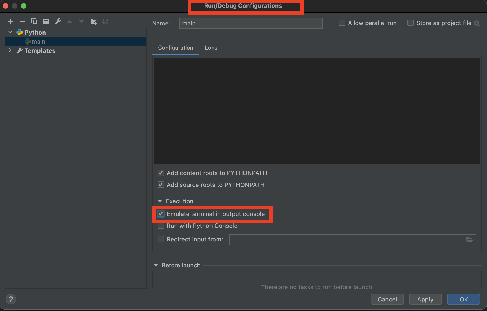

## Url Scrapper

The code tries to fetch given url recursively to fetch all the links and lists them.

Implementation has several approaches to do the same thing.

### How to run

- If docker is installed, Makefile can be used to build an image and run it using `make run`
- If you want to run directly using python 3 use `python main.py` after installing required packages
- If you want to use PyCharm, there is a need to change run configuration settings as shown in the below image.

#### TODO
- [ ] Planning to implement QueueExecutor to process in parallel, using asyncio semaphore
- [ ] Planning to implement tests